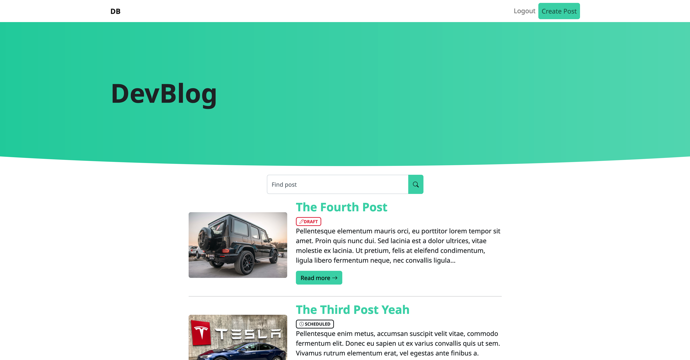

## FLask Blog

### Installation

  :::bash
  $ python -m venv .venv # create virtual environment

  $ source .venv/bin/activate

  $ pip install -r requirements.txt

  $ mkdir app/uploads

  $ export FLASK_DEBUG=True

  $ flask run